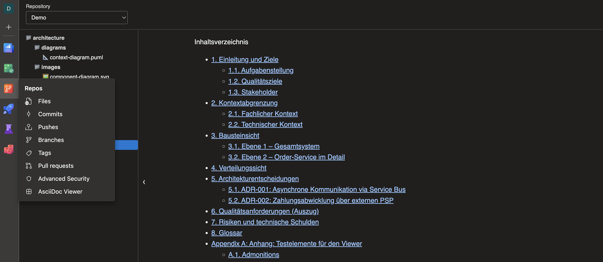
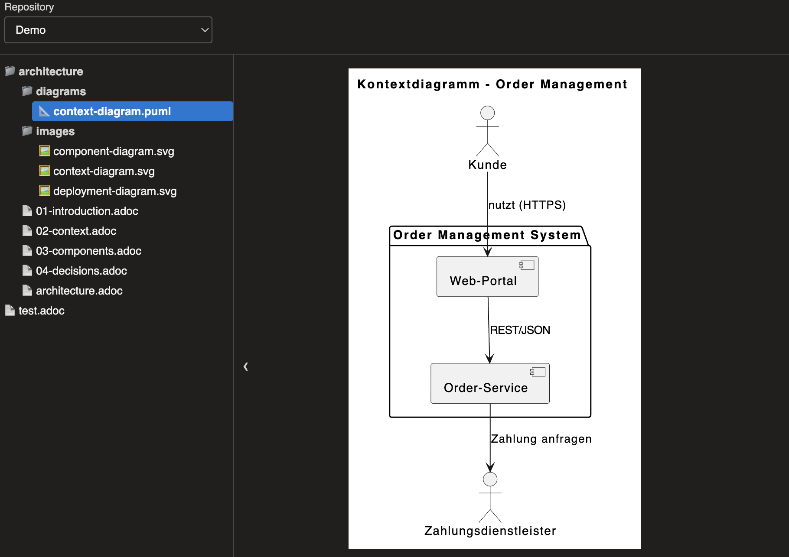
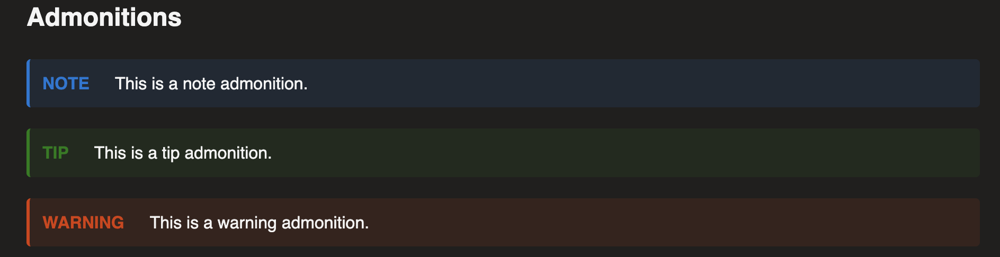

# AsciiDoc Viewer for Azure Repos

Browse and render AsciiDoc documentation directly in Azure Repos. Open the
**AsciiDoc Viewer** hub in Repos, select a document from the repository tree,
and read it without leaving Azure DevOps.

## Screenshots

### AsciiDoc Viewer

### Diagrams and images

### Dark theme

## Features

- Browse `.adoc` and `.asciidoc` files in the repository selected in the
  Azure DevOps breadcrumb.
- Resolve nested local `include::` directives in the same repository and
  branch/commit, with circular-include detection.
- Render block images (`image::...[]`) from the repository, including relative
  paths and `:imagesdir:`.
- Preview common image formats and PlantUML (`.puml` / `.plantuml`) files from
  the file tree.
- Render diagram blocks such as PlantUML, Mermaid, GraphViz, D2, and other
  Kroki-supported formats.
- Highlight common source languages and render AsciiDoc tables, lists,
  callouts, and table-of-contents blocks.
- Collapse the repository file tree for more document space.
- Use the Azure DevOps light or dark theme.

## Limitations and privacy

- This is a read-only viewer; file editing is not supported.
- Includes are limited to the same repository and selected version. External
  and cross-repository includes are not resolved.
- Only block image macros (`image::target[]`) are fetched from Azure Repos;
  inline image macros are not currently resolved.
- PlantUML and most other diagram types are rendered by
  [Kroki](https://kroki.io); Mermaid is rendered by
  [mermaid.ink](https://mermaid.ink). Diagram source is sent to the respective
  rendering service.

## Feedback and support

Please report bugs or feature requests in the
[GitHub issue tracker](https://github.com/klab365/asciidoc-viewer-azdevops/issues).

## License

[MIT](https://github.com/klab365/asciidoc-viewer-azdevops/blob/main/LICENSE)
